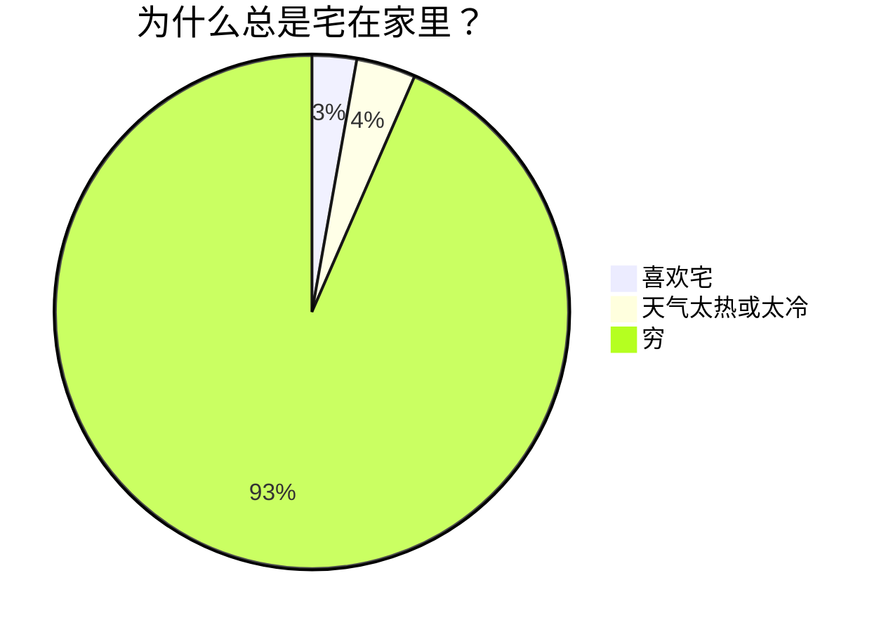
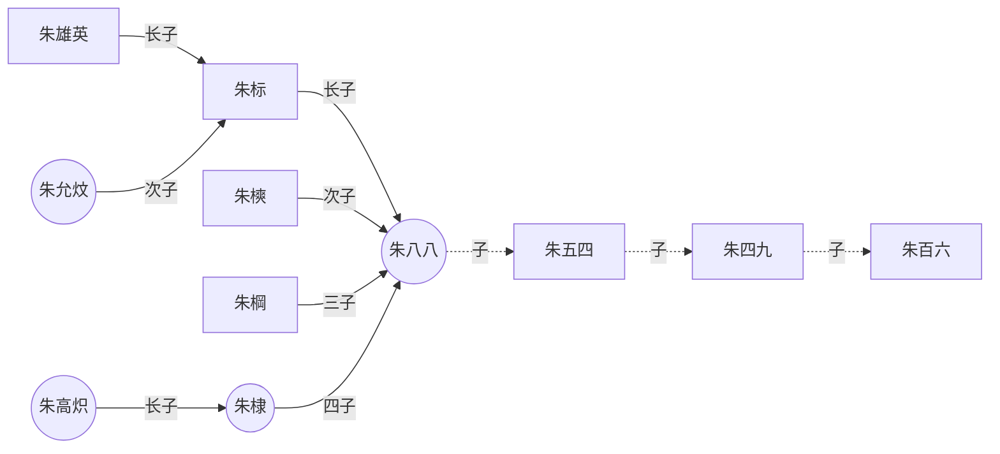
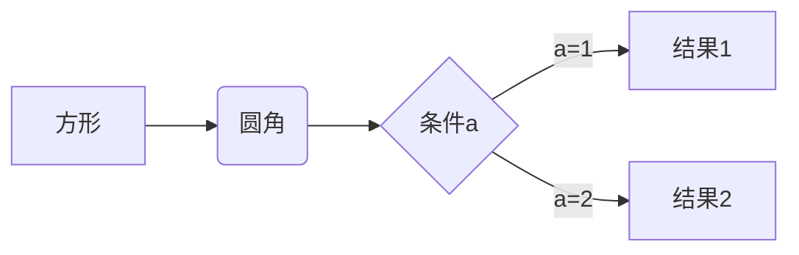
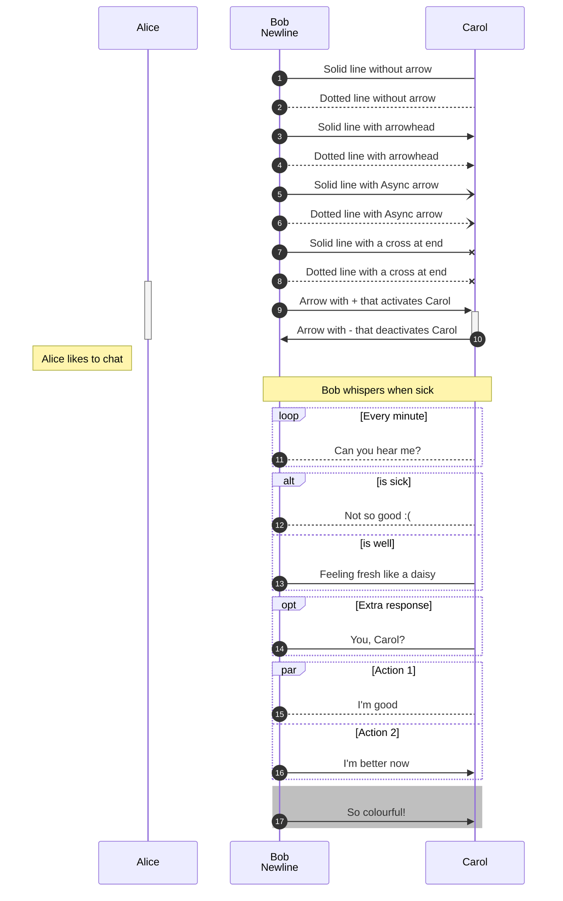
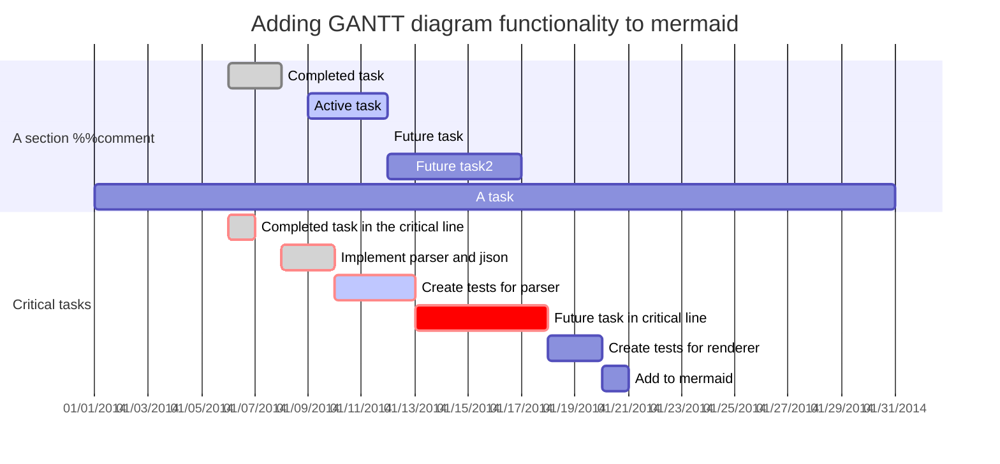
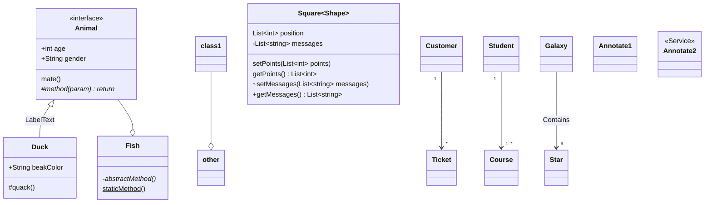
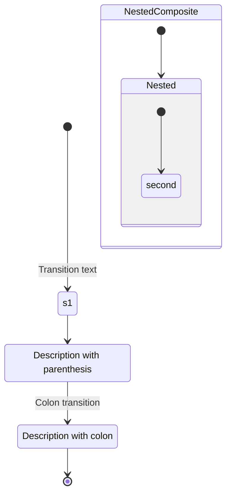
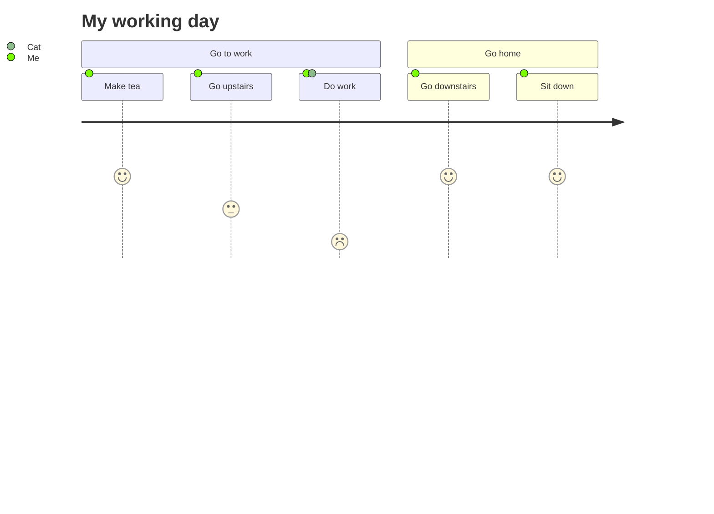

# 格式

&emsp;&emsp;测试文本空格  
~~删除线~~
>最外层
>>第一层
>>>第二层

:注释  
使用 <kbd>Ctrl</kbd>+<kbd>Alt</kbd>+<kbd>Del</kbd> 重启电脑

# 希腊字母

$$
\alpha \quad  \beta \quad \gamma  \quad \Gamma \quad \delta \quad \Delta \quad \epsilon \quad \varepsilon \quad \zeta \quad \theta \quad \eta \quad  \vartheta  \quad \pi \quad  \phi \quad  \psi  \quad \omega \quad  \sigma \quad  \Sigma \quad  \nu  \quad \xi  \quad \lambda  \quad \Lambda \mu \quad  \partial \quad  \lbrace \quad  \rbrace $$

```
\alpha \beta \gamma \Gamma \delta \Delta \epsilon \varepsilon \zeta \theta \eta \vartheta \pi \phi \psi \omega \sigma \Sigma \nu \xi \lambda 
\Lambda \mu \partial \lbrace \rbrace
```

# 矩阵
$$
\begin{matrix}
1 & 2& 3\\
1 & 2& 3\\
1 & 2& 3\\
\end{matrix}\tag{1}
$$

$$
\begin{vmatrix}
1 & 2& 3\\
1 & 2& 3\\
1 & 2& 3\\
\end{vmatrix}
\tag{1}
$$
$$
\begin{Vmatrix}
1 & 2& 3\\
1 & 2& 3\\
1 & 2& 3\\
\end{Vmatrix}
\tag{1}
$$


$$
\begin{bmatrix}
1 & 2& 3\\
1 & 2& 3\\
1 & 2& 3\\
\end{bmatrix}
\tag{1}
$$

$$
\begin{Bmatrix}
1 & 2& 3\\
1 & 2& 3\\
1 & 2& 3\\
\end{Bmatrix}\tag{1}
$$


$$
\begin{Bmatrix}
1 & 2&\cdots& 3\\
1 & 2&\cdots& 3\\
\vdots &\vdots &\ddots& 3\\
1 & 2&\cdots& 3\\
\end{Bmatrix}\tag{1}
$$

$$
\left[
\begin{array}{cc|c}
1 & 2& 3\\
1 & 2& 3
\end{array}
\right]
$$

$$
P(x|a_x)=\begin{cases}
1, & x=f(a_x) \\
0, & other\ values
\end{cases}
$$


# 数学公式
|符号|实现|符号|实现|
|----|----|----|----|
|$\sum$|\sum|$\sum_{i=0}^n$|\sum_{i=0}^n|
|$\times$|\times|$\pm$|\pm|
|$\div$|\div|$\mid$|\mid|
|$\cdot$|\cdot|$\circ$|\circ|
|$\ast$|\ast|$\le$|\le|
|$\ge$|\ge|$\approx$|\approx|
|$\prod$|\prod|$\cdots$|\cdots|
|$\int$|\int|$\infty$|\infty|
|$\therefore$|\therefore|$\forall$|\forall|
|$\exist$|\exist|$\subset$|\subset|
|$\subseteq$|\subseteq|$\bigcup$|\bigcup|
|$\bigcap$|\bigcap|$\bigvee$|\bigvee|
|$\bigwedge$|\bigwedge|$\hat{y}$|\hat{y}|
|$\hat{y}$|\hat{y}|$\dot{y}$|\dot{y}|
|$\widetilde{y}$|\widetilde{y}|$\ddot{y}$|\ddot{y}|
|$\overline{a+b+c+d}$|\overline{a+b+c+d}|$\underline{a+b+c+d}$|\underline{a+b+c+d}|
|$\overbrace{a+\underbrace{b+c}_{1.0}+d}^{2.0}$|\overbrace{a+\underbrace{bc}_{1.0}+d}^{2.0}|$\uparrow$|\uparrow|
|$\Uparrow$|\Uparrow|$\downarrow$|\downarrow|
|$\Downarrow$|\Downarrow|$\leftarrow$|\leftarrow|
|$\Leftarrow$|\Leftarrow|$\rightarrow$|\rightarrow|
|$\Rightarrow$|\Rightarrow|
|$\frac{a}{b}$|\frac|


# 制图







```mermaid
graph TB %% comments
  %% Entity[Text]
  ID-1[Node 1]
  ID-2>Node 2]
  ID-3(Node 3 <br> text)
  %% Entity--Entity
  ID-1---ID-2
  ID-1 --> ID-3
  %% Entity--Text--Entity
  ID-2--Link between 2 and 3---ID-3
  ID-3-->|Action from 3 to 1|ID-1
  ID-3 -- "Action from 3 to 2. p/w: '_-!#$%^&*+=?,\'" --> ID-2
  %% Complex cases
  A[Hard edge] -->|Link text| B(Round edge)
  ID-1---ID-2(Text)
  B --> C{Text}
  C -->|One| D[Text]
  A(A) --> B(B)
  C[/C/] --> D>D]
  %% class/classDef
  classDef blue fill:#08f,stroke:#fff;
  class ID-1 blue
  class ID-1,ID-2 red
  %% click
  click ID-1 "https://github.com" "Tooltip text" %% comments
  click ID-2 alert "Tooltip for a callback"
  %% subgraph
  subgraph A subgraph
    ID-4{Node 4}
    ID-5((fa:fa-spinner))
    ID-6["Node 6 (same #quot;shape#quot;)"]
    ID-4-.->ID-5
    ID-5 -. Action from 5 to 4 .-> ID-4
    ID-5==>ID-6
    ID-6 == Action from 6 to 5 ==> ID-5
  end
```















